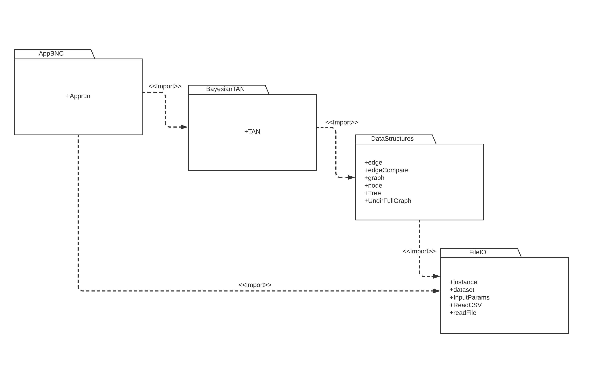

# Project Status
  
### O que falta fazer neste momento -  Project progress: %45
 
 *  Falta verificar antes de inserir um novo no, se este ja existe
 *  O mesmo aplica-se para os edges
 *  Falta Fazer as contagens e fazer update dos pesos - Implementar LL e MDL
 *  Falta tornar UndirFullgraph.MST() mais eficiente - O algoritmo testa sempre todas edges existentes apartir de  um no mesmo quando ja faz parte da MST Tree 
 *  Falta fazer os passos 4 e 5 da Structure Learning (pag 3)
 *  Falta implemntar o predict - Parameter learning (pag 3 - slack Q&A)
 *  Falta implementar metrics F1.score, accuracy, AvgAccuracy


# Theory Intro 


### Input 
X = ( X1, X2, ... ,Xn, C)

X1 = {a, ...,z} -> {x1, ..., x_{1(ri)} }  , ri = length ;
C - random const. 


##### Dataset T - training* 
```c
X1 X2 X3    ...  XX  C
1  2   3          0  0
1  0   0		  0	 0 
3  0   0          0  0
```


### Algorithm BNC 


**model B(X,G,Theta)**

> **X** - Input dataset
>
> **G** - Graph   G(X,E); X=nodes , E=edges 
>
> ***Theta*** -  BNC  parameter that can be call  as weights or probabilities 


* ***Theta*** = { P(Xi=x_{ik} |{Parents}), .. , (theta_{ijkc}) }

for each i, or X1,.., Xn:
**theta_{ijkc}** = (N_ijkc + N') / (Nijc^K} + ri \* N') 
**theta_{c}** = (Nc + N')/ (N + ri \* N') 

> N' = 0.5
>
> Nc - # de valores de C
>
> N - # linhas de T
>
> Nijkc - # valores possiveis para a config i=i',j=j',k=k' e c=z
>
> {Nijc^{k}} - # valores possiveis que o parent de N_{ijkc} pode ter
>
> \Pi_{X_{i}} - conjunto de possiveis parents de  Xi em G, excluindo C


```
# Dataset Train - T
# X Y
# 1 3
# 2 2


object = BNC(X,G,Theta)
object.train(T)
Y' = object.predict(X)

# X Y' - Dataset Predicted
# 1 2
# 2 4

score = metric.f1()
evaluation = score(Y_benchmark, Y' )
```
# BNC  to TAN - It's a good approximation!


>   ***Definitions:***
>
>    TAN approx. to BNC 
>
>    TAN means Tree argumented Naive Bayes Classifier 

**Flowchart**
*TAN learning w/ Train data (only 1x) ----> TAN predict w/ Test data (many times as you want) ----> TAN score (measure the results)* 

- **`TAN.train(Y_train,X_train)`** 
    1.  Read T and convert it into Graph G (using LL or MDL)  
    2.  Use PRIM or Kruskal to find/create MWST from G   
    3.  Choose a root from MWST and add directions
    4.  Based on weights already calculated with  LL (or MDL) and graph directions, compute the thetas 

- **`Y_predicted = TAN.predict(X_test)`**
    1. With the (thetas) parameters already calculated, apply the probabilities formula that exists at Slack Q&A

- **`Score.f1(Y_predicted, Y_test)`**
    1. Implement the requested project metrics 


# Code Diagram 




